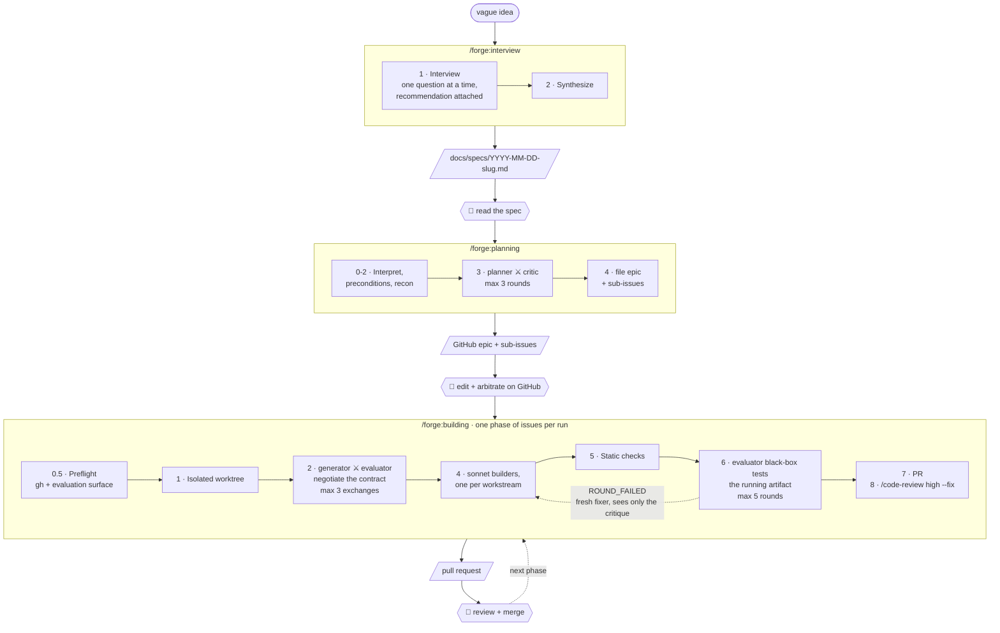

# Forge

An idea-to-PR pipeline for [Claude Code](https://claude.com/claude-code), with a human gate at each seam. Three commands, run in order.

```
/forge:interview   vague idea         ->  docs/specs/YYYY-MM-DD-<slug>.md
/forge:planning    spec               ->  GitHub epic + sub-issues (adversarially reviewed)
/forge:building    signed-off issues  ->  pull request (black-box tested against a contract)
```

Each stage stops and hands you an artifact. Nothing runs the next stage on your behalf.

## Install

```
/plugin marketplace add dasirra/cc-forge
/plugin install forge@cc-forge
```

## Requirements

`/forge:interview` needs nothing and works outside a repository.

The other two need:

- **`gh` CLI, authenticated**, in a repo with a GitHub remote. `/forge:planning` files issues; `/forge:building` reads them and opens the PR.
- **A way to run your project and observe it from outside.** `/forge:building` resolves an *evaluation surface* up front (`web`, `library`, `cli`, `service`, or `native`) and black-box tests the contract against it. Only `web` needs an extra dependency: a browser automation MCP server, Claude in Chrome or Playwright.
- **`/code-review`**, invoked by `/forge:building` for the final review of the integrated diff.

## Commands

| Command | Description |
|---------|-------------|
| `/forge:interview [idea \| path/to/brief.md]` | Relentless one-question-at-a-time grilling until you and Claude share an understanding of the idea, then synthesis into a PM-level spec. No code, no issues. |
| `/forge:planning [path/to/spec.md \| description]` | A planner drafts an epic with user stories, a critic attacks it in a separate context, they iterate up to 3 rounds. Files the result as a GitHub epic with native sub-issues for async human review. |
| `/forge:building <#issue ...> [--gate] [--max-rounds N] [--base <branch>] [--surface <name>]` | A generator and evaluator negotiate a granular contract of "done", a team builds in an isolated worktree, then the evaluator black-box tests the running artifact against that contract until it passes: driving a browser for a web app, calling the public API for a library, running argv and reading exit codes for a CLI. Opens a PR. |

## Pipeline

Adversarial pairs (⚔) never share context. They exchange files, relayed by the orchestrator. Every 👤 is a stop: the command hands you an artifact and prints the next step rather than running it.



The contract negotiated in Phase 2 is the only plan `/forge:building` makes. There is no PLAN.md. Technical decisions belong to the builders, made against the code as they work, and Phase 6 judges the result against the contract rather than against the builders' account of it.

Every phase, agent, artifact, and loop is laid out in the [full pipeline reference](https://htmlpreview.github.io/?https://github.com/dasirra/cc-forge/blob/main/docs/pipeline.html), which also documents the evaluation surfaces. Source: [`docs/pipeline.html`](docs/pipeline.html).

## Design

Three ideas run through all three commands.

**Separate contexts, artifacts only.** Every adversarial pair (planner/critic, generator/evaluator) communicates through files, never through summarized reasoning. A critic that sees the planner's rationale rubber-stamps it.

**Altitude discipline.** `/forge:interview` and `/forge:planning` are banned from naming files, schemas, or libraries. Technical contracts get negotiated at `/forge:building` time against the codebase as it exists then, so they cannot go stale between planning and building.

**Observed behavior beats claims.** `/forge:building` will not accept "mostly works". Each contract criterion passes or fails, judged by an evaluator driving the running artifact, not by reading the diff and not by running the builder's own tests. Those tests encode the builder's understanding, so a green suite certifies whatever misunderstanding produced the bug.

## Portability

Forge is Claude Code specific, and not incidentally so. It depends on subagents with genuinely separate context windows, per-role model selection, isolated git worktrees, and, for web projects, a browser-driving MCP server. The methodology travels to any agent; this implementation does not.

## Credits

Forge is an implementation of ideas from two [AI Engineer](https://www.ai.engineer/) talks. The mistakes in assembling them are mine.

**[Full Walkthrough: Workflow for AI Coding](https://www.youtube.com/watch?v=-QFHIoCo-Ko)**, Matt Pocock. The grilling session that became `/forge:interview`, the smart zone and dumb zone, slicing work into vertical issues an agent can pick up independently, and the distinction between running an agent human-in-the-loop and running it AFK.

**[Build Agents That Run for Hours (Without Losing the Plot)](https://www.youtube.com/watch?v=mR-WAvEPRwE)**, Ash Prabaker and Andrew Wilson, Anthropic. The generator/evaluator pattern, contract negotiation through files on disk, the case against granular upfront technical planning, and the observation that models are poor judges of their own output. `/forge:building` is largely this talk, made concrete.

## License

MIT
