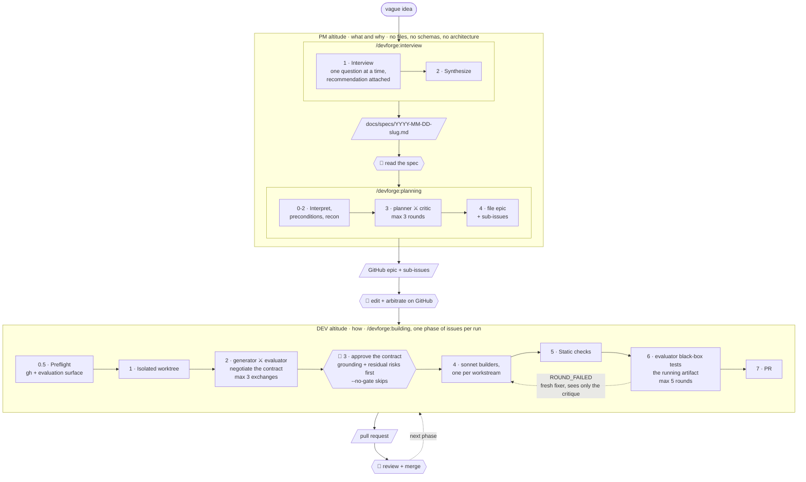

[](https://claude.com/claude-code)
[](docs/harness-bindings/README.md)
[](LICENSE)
[](https://github.com/dasirra/devforge/stargazers)
[](https://github.com/dasirra/devforge/commits/main)
[](https://www.buymeacoffee.com/dasirra)

An opinionated idea-to-PR workflow for coding agents, with a human gate at each seam. Three skills, run in order. Reference implementation is [Claude Code](https://claude.com/claude-code); Pi and Google Antigravity run the same skills through per-harness bindings, see [Portability](#portability).

```
PM   /devforge:interview   vague idea         ->  docs/specs/YYYY-MM-DD-<slug>.md
PM   /devforge:planning    spec               ->  GitHub epic + sub-issues (adversarially reviewed)
     ----------------------------------------------------------------- human gate
DEV  /devforge:building    signed-off issues  ->  pull request (black-box tested against a contract)
```

Each stage stops and hands you an artifact. Nothing runs the next stage on your behalf.

## Two altitudes

The line between `PM` and `DEV` is the one rule everything else hangs off.

**`/devforge:interview` and `/devforge:planning` work at PM altitude: what and why.** They're forbidden from naming a file, schema, function, library, table, or endpoint. Specs and issues describe observable behavior only: user stories, empty/error/edge states, scope, dependencies. A reviewer who reads nothing but the issues should understand the whole change. If the planner leaks a technical detail, the orchestrator strips it before filing.

**`/devforge:building` works at DEV altitude: how.** It negotiates a contract of testable criteria against the codebase as it exists right now, not as planning imagined it (a criterion like `parse("") raises ValueError containing "empty input"` is the only kind an evaluator can actually check). There is no upfront technical plan, no `PLAN.md`: the contract states what "done" means, builders decide how to get there against live code.

Between the two sits a human gate: issues land on GitHub and stop there until you read, edit, and arbitrate them.

Why split it this way? An architecture decided before the work starts is a decision made with the least information you will ever have. By the time someone implements it, the codebase has moved. Behavior is what survives contact with the code; a class diagram embedded in a two-week-old ticket doesn't.

## Install

```
/plugin marketplace add dasirra/devforge
/plugin install devforge@devforge
```

## Requirements

`/devforge:interview` needs nothing and works outside a repository.

The other two need:

- **`gh` CLI, authenticated**, in a repo with a GitHub remote. `/devforge:planning` files issues; `/devforge:building` reads them and opens the PR.
- **A way to run your project and observe it from outside.** `/devforge:building` resolves an *evaluation surface* up front (`web`, `library`, `cli`, `service`, or `native`) and black-box tests the contract against it. Only `web` needs an extra dependency: a browser automation MCP server, Claude in Chrome or Playwright.

These are the Claude Code requirements. Other harnesses swap the subagent mechanism and, for `web`, the browser driver accordingly; see [`docs/harness-bindings/`](docs/harness-bindings/README.md) for what each one needs and which evaluation surfaces it supports.

## Skills

| Skill | Altitude | Description |
|---------|----------|-------------|
| `/devforge:interview [idea \| path/to/brief.md]` | PM | Relentless one-question-at-a-time grilling until you and Claude share an understanding of the idea, then synthesis into a PM-level spec. No code, no issues. |
| `/devforge:planning [path/to/spec.md \| description]` | PM | A planner drafts an epic with user stories and acceptance criteria as Given/When/Then scenarios, a critic attacks it in a separate context, they iterate up to 3 rounds. Files the result as a GitHub epic with native sub-issues for async human review. No technical content: no files, no schemas, no architecture. |
| `/devforge:building <#issue ...> [--no-gate] [--max-rounds N] [--base <branch>] [--surface <name>]` | DEV | A generator and evaluator negotiate a granular contract of "done" against the live codebase, each criterion carrying a worked example, a team builds in an isolated worktree, then the evaluator black-box tests the running artifact against that contract until it passes: driving a browser for a web app, calling the public API for a library, running argv and reading exit codes for a CLI. Opens a PR. |

## Pipeline

Adversarial pairs (⚔) never share context. They exchange files, relayed by the orchestrator. Every 👤 is a stop: the skill hands you an artifact and prints the next step rather than running it.



The contract negotiated in Phase 2 is the only plan `/devforge:building` makes: no PLAN.md, no upfront technical design. Facts are the exception: before writing a criterion, the generator declares every store, path, env var, and dependency it will name as `EXISTS` (with `file:line` evidence) or `NEW`; any `NEW` persistent substrate stops the run for one human question, gate or no gate.

By default the pipeline pauses on that negotiated contract for your approval, since it's the last artifact you can correct cheaply: every builder and sibling issue inherits its premises. `--no-gate` skips the pause when you already trust it.

Full detail on every phase, agent, artifact, and loop: [pipeline reference](https://htmlpreview.github.io/?https://github.com/dasirra/devforge/blob/main/docs/pipeline.html) ([source](docs/pipeline.html)).

## Design

Three ideas run through all three skills.

**Separate contexts, artifacts only.** Every adversarial pair (planner/critic, generator/evaluator) communicates through files, never through summarized reasoning. A critic that sees the planner's rationale rubber-stamps it.

**Altitude discipline.** PM skills describe behavior, the DEV skill decides implementation, and the contract that binds them is negotiated against the codebase as it exists at build time, so it cannot go stale between planning and building. See [Two altitudes](#two-altitudes).

**Observed behavior beats claims.** `/devforge:building` will not accept "mostly works". Each contract criterion passes or fails, judged by an evaluator driving the running artifact, not by reading the diff and not by running the builder's own tests. Those tests encode the builder's understanding, so a green suite certifies whatever misunderstanding produced the bug.

## Portability

Skills are written in harness-neutral prose: role tiers (`judgment-tier`, `labor-tier`) instead of one agent's tool and model names. Each supported harness maps those to concrete tools and models:

- **Claude Code**: opus for judgment-tier, sonnet for labor-tier.
- **Pi** (open-weight models, e.g. via Ollama): one model for every tier; needs the `pi-subagents` package for forked-context subagents.
- **Google Antigravity**: Gemini 3.1 Pro for judgment-tier, Gemini 3.5 Flash for labor-tier.

What makes a pair adversarial is separated contexts, not different models: a harness running one model on both sides keeps the method as long as its subagents are genuinely forked-context. Full mapping and caveats per harness: [`docs/harness-bindings/`](docs/harness-bindings/README.md).

## Credits

DevForge assembles ideas that are not mine; the opinions and mistakes in assembling them are.

Mine: the three-skill shape with a human gate at each seam, `/devforge:planning` as an adversarial PM pass that files straight to GitHub for human arbitration, the altitude discipline that bans technical content until `/devforge:building` negotiates it live, the evaluation surfaces and preflight, and the rule that the evaluator never runs the builders' own tests.

- **[Full Walkthrough: Workflow for AI Coding](https://www.youtube.com/watch?v=-QFHIoCo-Ko)**, Matt Pocock ([AI Engineer](https://www.ai.engineer/)): the grilling session behind `/devforge:interview`, smart/dumb zone, vertical issue slicing, human-in-the-loop vs. AFK.
- **[Build Agents That Run for Hours](https://www.youtube.com/watch?v=mR-WAvEPRwE)**, Ash Prabaker & Andrew Wilson (Anthropic, AI Engineer): the generator/evaluator pattern and contract negotiation through files on disk. `/devforge:building` is largely this talk, made concrete.
- **[superpowers](https://github.com/obra/superpowers)**, Jesse Vincent (obra): one-question-at-a-time brainstorming, worktree isolation before implementation, verified rather than asserted completion.

## License

MIT
