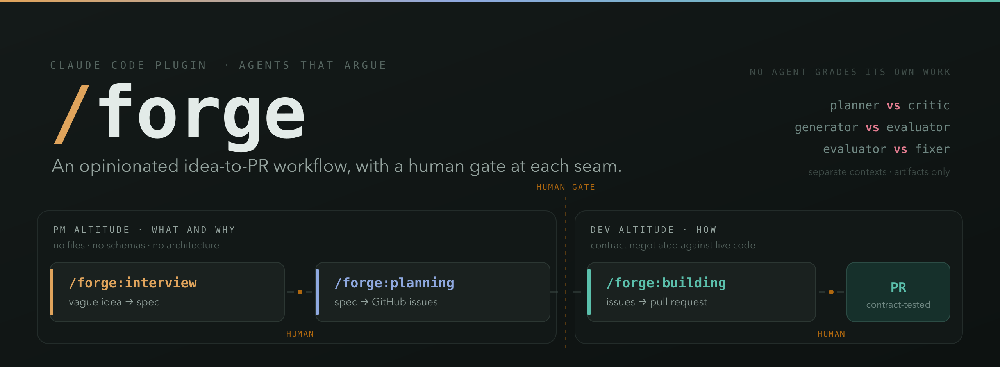

[](https://claude.com/claude-code)
[](LICENSE)
[](https://github.com/dasirra/cc-forge/stargazers)
[](https://github.com/dasirra/cc-forge/commits/main)

An opinionated idea-to-PR workflow for [Claude Code](https://claude.com/claude-code), with a human gate at each seam. Three skills, run in order.

```
PM   /forge:interview   vague idea         ->  docs/specs/YYYY-MM-DD-<slug>.md
PM   /forge:planning    spec               ->  GitHub epic + sub-issues (adversarially reviewed)
     ----------------------------------------------------------------- human gate
DEV  /forge:building    signed-off issues  ->  pull request (black-box tested against a contract)
```

Each stage stops and hands you an artifact. Nothing runs the next stage on your behalf.

## Two altitudes

The line between `PM` and `DEV` is the one rule everything else hangs off.

**`/forge:interview` and `/forge:planning` work at PM altitude. They answer what and why.** They are forbidden from naming a file, a schema, a function, a library, a table, or an endpoint. What they produce, the spec and then the GitHub issues, describes observable behavior only: user stories, how the product responds including its empty and error and edge states, scope boundaries, and dependencies between issues. A reviewer who reads nothing but the issues should understand the whole proposed change. If the planner leaks a technical detail, the orchestrator strips it before filing.

This is deliberate, and it costs something, so it's worth saying why.

An architecture decided before the work starts is a decision made with the least information you will ever have. By the time someone implements it, the codebase has moved, and everyone is now bound to a design chosen against a repository that no longer exists. Worse, it invites the wrong review. Nobody usefully argues about a class diagram embedded in a ticket that gets picked up in two weeks. People argue well about behavior, and behavior is exactly what survives contact with the codebase.

**`/forge:building` works at DEV altitude. It answers how.** The first thing it does is negotiate a contract: granular, testable criteria, written against the codebase as it exists at that moment, not as someone imagined it during planning. Technical specificity is not merely allowed here, it is required, because a criterion like `parse("") raises ValueError whose message contains "empty input"` is the only kind an evaluator can actually check.

Even at DEV altitude there is no upfront technical plan and no `PLAN.md`. The contract states what "done" means; the builders decide how to get there, against live code, as they work.

Between the two sits a human gate. The issues land on GitHub and stop there. You read them, edit them, arbitrate whatever the planner and critic could not agree on, and only then does any code exist.

## Install

```
/plugin marketplace add dasirra/cc-forge
/plugin install forge@cc-forge
```

## Requirements

`/forge:interview` needs nothing and works outside a repository.

The other two need:

- **`gh` CLI, authenticated**, in a repo with a GitHub remote. `/forge:planning` files issues; `/forge:building` reads them and opens the PR.
- **A way to run your project and observe it from outside.** `/forge:building` resolves an *evaluation surface* up front (`web`, `library`, `cli`, `service`, or `native`) and black-box tests the contract against it. Only `web` needs an extra dependency: a browser automation MCP server, Claude in Chrome or Playwright.

## Skills

| Skill | Altitude | Description |
|---------|----------|-------------|
| `/forge:interview [idea \| path/to/brief.md]` | PM | Relentless one-question-at-a-time grilling until you and Claude share an understanding of the idea, then synthesis into a PM-level spec. No code, no issues. |
| `/forge:planning [path/to/spec.md \| description]` | PM | A planner drafts an epic with user stories, a critic attacks it in a separate context, they iterate up to 3 rounds. Files the result as a GitHub epic with native sub-issues for async human review. No technical content: no files, no schemas, no architecture. |
| `/forge:building <#issue ...> [--no-gate] [--max-rounds N] [--base <branch>] [--surface <name>]` | DEV | A generator and evaluator negotiate a granular contract of "done" against the live codebase, a team builds in an isolated worktree, then the evaluator black-box tests the running artifact against that contract until it passes: driving a browser for a web app, calling the public API for a library, running argv and reading exit codes for a CLI. Opens a PR. |

## Pipeline

Adversarial pairs (⚔) never share context. They exchange files, relayed by the orchestrator. Every 👤 is a stop: the skill hands you an artifact and prints the next step rather than running it.


The contract negotiated in Phase 2 is the only plan `/forge:building` makes. There is no PLAN.md. Technical decisions belong to the builders, made against the code as they work, and Phase 6 judges the result against the contract rather than against the builders' account of it.

Facts are the exception, because a fact is not a decision. Before it writes a single criterion, the generator declares every store, path, env var, collection, and dependency its contract will name, each marked `EXISTS` with `file:line` evidence or `NEW`. The lead reproduces each `EXISTS` with a grep, and any `NEW` persistent substrate stops the run for one human question, gate or no gate. Deferring a decision keeps options open; deferring a fact just means somebody downstream invents it, and inventing and discovering look identical from inside a contract.

For the same reason, `/forge:building` pauses on the negotiated contract by default, showing you the grounding block and the evaluator's residual risks before the criteria. The contract is the last artifact you can correct cheaply: after it, every criterion, every builder and every sibling issue inherits its premises. `--no-gate` runs straight through when you already trust them.

Every phase, agent, artifact, and loop is laid out in the [full pipeline reference](https://htmlpreview.github.io/?https://github.com/dasirra/cc-forge/blob/main/docs/pipeline.html), which also documents the evaluation surfaces. Source: [`docs/pipeline.html`](docs/pipeline.html).

## Design

Three ideas run through all three skills.

**Separate contexts, artifacts only.** Every adversarial pair (planner/critic, generator/evaluator) communicates through files, never through summarized reasoning. A critic that sees the planner's rationale rubber-stamps it.

**Altitude discipline.** PM skills describe behavior, the DEV skill decides implementation, and the contract that binds them is negotiated against the codebase as it exists at build time, so it cannot go stale between planning and building. See [Two altitudes](#two-altitudes).

**Observed behavior beats claims.** `/forge:building` will not accept "mostly works". Each contract criterion passes or fails, judged by an evaluator driving the running artifact, not by reading the diff and not by running the builder's own tests. Those tests encode the builder's understanding, so a green suite certifies whatever misunderstanding produced the bug.

## Portability

Forge is Claude Code specific, and not incidentally so. It depends on subagents with genuinely separate context windows, per-role model selection, isolated git worktrees, and, for web projects, a browser-driving MCP server. The methodology travels to any agent; this implementation does not.

## Credits

Forge is an opinionated idea-to-PR workflow. It assembles ideas that are not mine, and the opinions and the mistakes in assembling them are.

Mine are the three-skill shape with a human gate at each seam, `/forge:planning` as an adversarial PM-level pass that files straight to GitHub and leaves contested items for a human to arbitrate, the altitude discipline that bans technical content until `/forge:building` negotiates it against the live codebase, the evaluation surfaces and the preflight that resolves one before anything expensive happens, and the rule that the evaluator never runs the builders' own tests.

**[Full Walkthrough: Workflow for AI Coding](https://www.youtube.com/watch?v=-QFHIoCo-Ko)**, Matt Pocock, at [AI Engineer](https://www.ai.engineer/). The grilling session that became `/forge:interview`, the smart zone and dumb zone, slicing work into vertical issues an agent can pick up independently, and the distinction between running an agent human-in-the-loop and running it AFK, unattended and away from the keyboard.

**[Build Agents That Run for Hours (Without Losing the Plot)](https://www.youtube.com/watch?v=mR-WAvEPRwE)**, Ash Prabaker and Andrew Wilson of Anthropic, at AI Engineer. The generator/evaluator pattern, contract negotiation through files on disk, the case against granular upfront technical planning, and the observation that models are poor judges of their own output. `/forge:building` is largely this talk, made concrete.

**[superpowers](https://github.com/obra/superpowers)**, Jesse Vincent (obra). An agentic skills framework and development methodology. The one-question-at-a-time brainstorm, worktree isolation before any implementation work begins, and the insistence that completion be verified rather than asserted.

## License

MIT
